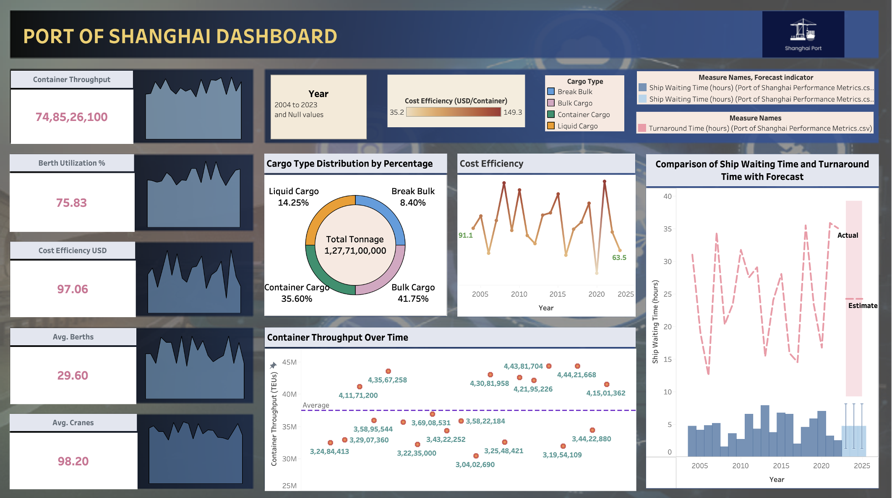

# 🚢 Port of Shanghai — Operations Dashboard & Visualisation


> An interactive operational performance dashboard for the world's busiest port — analysing 20 years of container throughput, berth utilisation, cost efficiency, and resource data (2004–2023).

---

## 📌 Project Overview

The Port of Shanghai is the world's busiest container port, handling over 47 million TEUs annually and playing a critical role in global supply chains. This project builds a comprehensive performance dashboard that consolidates 20 years of operational data, enabling port management and analysts to identify long-term trends, efficiency bottlenecks, and resource optimisation opportunities.

By transforming raw operational metrics into clear, interactive visualisations, this dashboard supports data-driven decision-making at one of the most strategically important logistics hubs in the world.

---

## 🎯 Objectives

- Consolidate 20 years of port operational data into a single, coherent dashboard
- Track and visualise key performance indicators (KPIs) across container throughput, costs, and resource utilisation
- Identify trends, seasonal patterns, and efficiency improvements over time
- Demonstrate proficiency in data visualisation, BI tooling, and operational analytics

---

## 📂 Repository Structure

```
Port-of-Shanghai-Visualization/
│
├── Port.png        # Dashboard preview image
├── README.md
└── LICENSE
```

---

## 📊 Dashboard Overview

The dashboard covers the following key performance areas:

### 🏗️ Container Throughput
- Annual and quarterly TEU (Twenty-foot Equivalent Unit) volume from 2004 to 2023
- Year-on-year growth trends highlighting periods of rapid expansion and external disruption (e.g. COVID-19 impact, 2021 trade surge)

### ⚓ Berth Utilisation
- Berth occupancy rates over time
- Analysis of under-utilised vs. over-capacity periods
- Correlation between utilisation rates and throughput volumes

### 💰 Cost Efficiency
- Operational cost per TEU trends across the 20-year period
- Identification of cost reduction milestones linked to infrastructure investments
- Cargo type breakdown by cost profile

### ⏱️ Ship Waiting Times
- Average vessel waiting time trends
- Periods of congestion and improvement linked to capacity expansions
- Relationship between waiting time and berth utilisation rates

### 🚢 Resource Availability
- Equipment and labour resource availability over time
- Seasonal fluctuation in resource demand vs. supply

---

## 📈 Key Insights

- Container throughput grew from ~14M TEU (2004) to ~47M TEU (2023), a 3× increase over 20 years
- Cost per TEU decreased significantly following major infrastructure upgrades in 2010–2015
- Ship waiting times spiked sharply in 2021, reflecting global supply chain disruptions post-COVID
- Berth utilisation consistently exceeds 85%, indicating the port operates near capacity

---

## 🛠️ Technologies Used

- **Visualisation:** Power BI / Matplotlib / Seaborn
- **Data Processing:** Python (Pandas, NumPy)
- **Language:** Python 3
- **Environment:** Jupyter Notebook

---

## 🖼️ Dashboard Preview



---

## 🚀 Getting Started

```bash
# Clone the repository
git clone https://github.com/rachitkhn/Port-of-Shanghai-Visualization.git
cd Port-of-Shanghai-Visualization
```

To explore the full interactive dashboard, open the `.pbix` file in **Power BI Desktop**, or run the Python notebook for the Matplotlib-based visualisations.

---

## 💡 Applications

- **Port Operations Management:** Monitor KPIs and identify inefficiencies in real time
- **Infrastructure Planning:** Use historical throughput trends to forecast future capacity needs
- **Supply Chain Analytics:** Understand how port performance impacts global logistics
- **Policy & Investment Decisions:** Data-backed evidence for infrastructure investment prioritisation

---

## 👤 Author

**Rachit Khandelwal**
[GitHub](https://github.com/rachitkhn) · [LinkedIn](https://linkedin.com/in/rachitkhn)

---

*This project was developed as part of a data science and analytics portfolio, demonstrating expertise in operational data analysis, KPI dashboard design, and large-scale data visualisation.*
